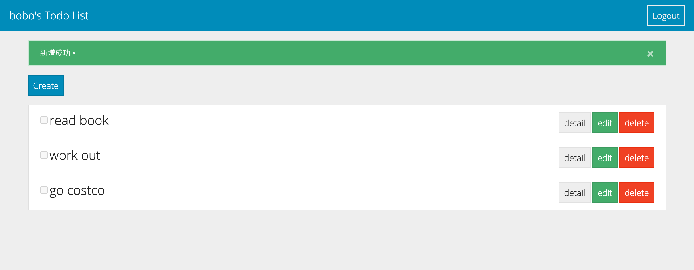

<!-- ABOUT THE PROJECT 3 A15: 補完 To-do List x Sequelize (Final at 2021/08/18) -->
## :pencil: Todo List (Sequelize Version)



### :heavy_check_mark: Features

1. 使用者可以從首頁瀏覽所有屬於自己的 todo list

2. 使用者可以新增一筆 Todo

3. 使用者可以編輯一筆 Todo

4. 使用者可以刪除一筆 Todo
  
5. 新使用者可以註冊帳號並登入，使用自己的帳號使用 todo list

<!-- GETTING STARTED -->
## :bulb: Getting Started

#### Clone repository
```
$ git clone https://github.com/BoboLin945/todo-list-sequelize.git
```
#### Install by npm
```
$ npm install
```
#### DB Seed
```
$ npm run seed
```
#### Execute
```
$ npm run dev
```
#### Browse the website on localhost
```
http://localhost:3000/
```


### 🔧  Built With

* [Node.js](https://nodejs.org/en/) (^10.15.0)
* [Express](https://expressjs.com/)   (^4.17.1)
* [Express-Handlebars](https://www.npmjs.com/package/express-handlebars) (^5.3.2)
* [sequelize](https://sequelize.org/) (^6.6.5)
* [passport.js](http://www.passportjs.org/) (^0.4.1)
* connect-flash (^0.1.1)
* Bootstrap